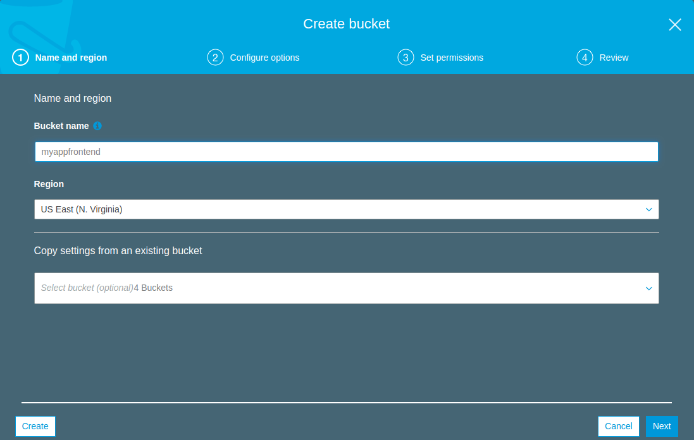
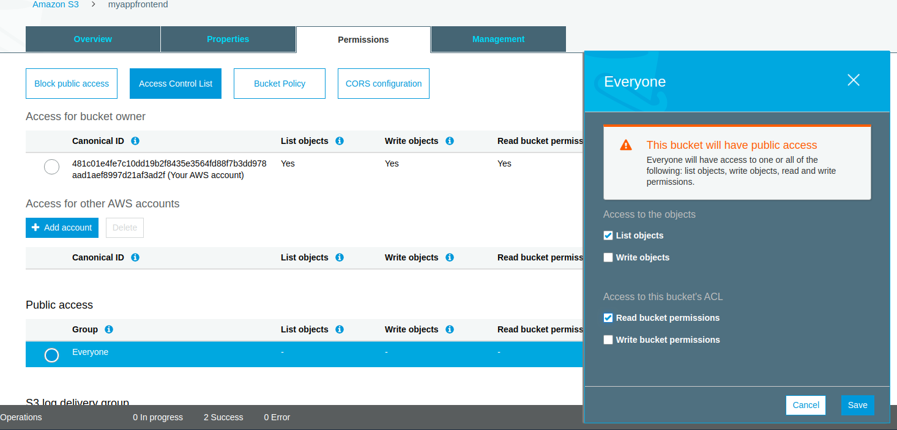
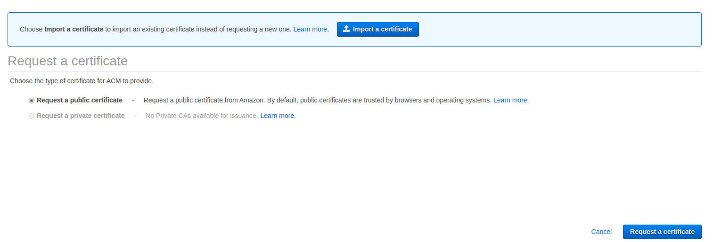
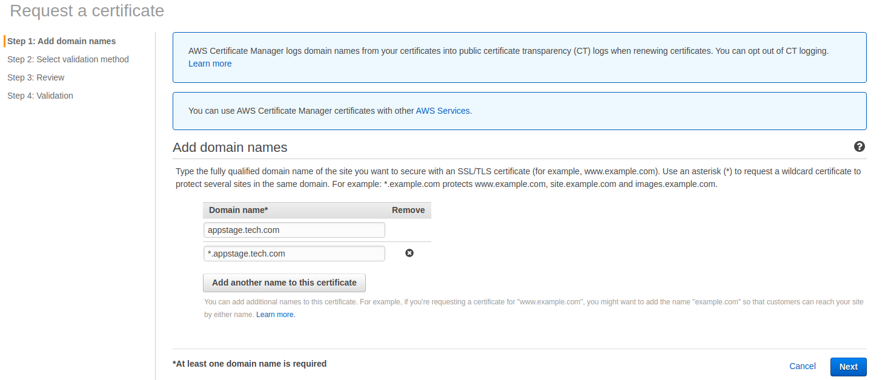
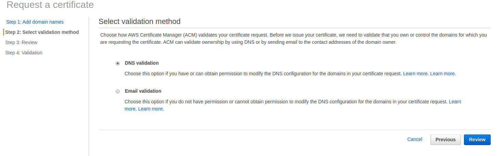
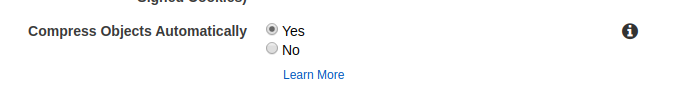
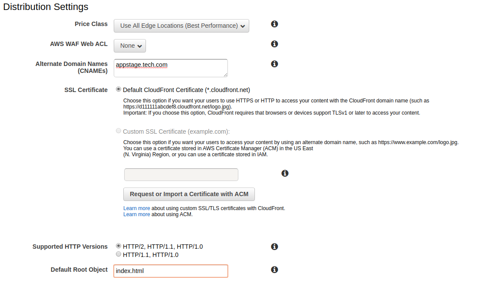
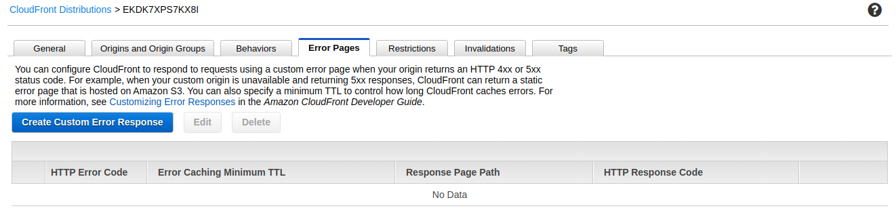
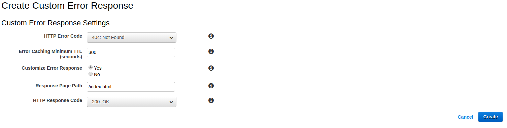
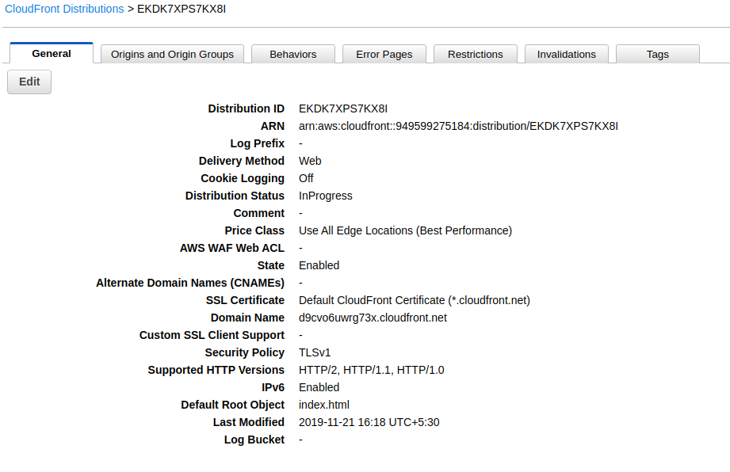

# Front-end deployment using aws s3 and cloudfront
---
Here we are using aws services for deploying our front-end service. Please follow the below steps to complete your front-end deployment.

Before starting your front-end deployment you need to understand the procedure for that, so now you are having `demo-client` folder in that you are having your front-end code. we need to build the frontend and push it to our s3 bucket. By using cloudfront it will distribute the application and user can access that application by using browser.

 ##### Requirements :-
  - S3
  - Certificate Manager
  - Cloudfront
  - DNS

#### Steps :-

* Login your aws account and select s3 from the aws services.
* Create a new bucket with your convenient name. for example lets assume the bucket name is `myappfrontend`
* Choose the region `US East (N. Virginia)` or `Asia Pacific (Mumbai)` else the region depends upon you. Now i am using `US East (N. Virginia)` and hit `create` button for creating the bucket.

* Now we need to configure our `myappfrontend`.
* Select your bucket and goto the permissions page, there you can find `block all public access`. Click edit button, uncheck the `block all public access` save and confirm.


* On the same permissions page you can find `Access Control List`, choose that option and under the `public access` you have group with the name of `Everyone`, there select `Everyone` and  provide `List objects & Read Bucket permissions` save the changes.


* Now goto properties page select `static website hosting` and choose `Use this bucket to host a website` option. Enter `index.html` in both `index & error document` and save the configuration.


* S3 `myappfrontend` bucket configuration completed will move to Certificate Manager.
* Goto `Certificate Manager` in aws services, choose `Provision certificates` then choose `Request a public certificate` and hit `Request a certificate`.

* Add your frontend domain name under domain name and hit next.

  * if incase in your project you want to redirect your services form `appstage.tech.com` to `some.appstage.tech.com`, add `*.appstage.tech.com` with appstage.tech.com. Please refer the below image.
  
* Choose `DNS validation` and hit `Review` and confirm and request.

* After confirmation, you will get pending validation with cname with values. If you are hosting DNS at `Route53`, hit `create record in Rooute53`. It will automatically add the `CNAME` record in Route53.

|Host                    |Type       | value                 |
|:------------------------:|:---------:|:-------------------:|
|_cc6d7db037854a3ef744ee5a9d82fc49.appstage.tech.com   |  CNAME | _4e374eebde3ab8e059d5c56c13fa43a8.kirrbxfjtw.acm-validations.aws  |

    *  If you using other DNS provider, you need to create `CNAME` record manualy. please refer the above table for aadding `CNAME`.
* Once you complete the record you will get `success dialougebox` and hit continue. After adding your `CNAME` record it will take sometime for success state. If you are lucky you will get immediate certificate.

* wait till validation complete. Once you done the validation, then you can start to create Cloudfront.(If you are entered correct valume in record, it will take few minutes to maximum 30 minutes time).
* Now you can ready to create cloudfront.
* Goto `cloudfront` service in aws and hit `create Distribution`.
* In `Select a delivery method for your content` choose web and hit `Get started` .
* In create Distribution page, under `Origin Settings` choose your bucket name(myappfrontend.s3.amazonaws.com) as origin domain name.
* In the "Viewer Protocol Policy" select "Redirect HTTP to HTTPS"
 
* In the "Compress Object Aautomatically", select "Yes" option (This will enable gzip)
 
* Under `Distribution Settings` -> alternate domain names, enter the domain you want (For example here i am using  `appstage.tech.com`, if you have `*.appstage.tech.com` enter the both names over there).

* In `SSL certificate`, choose `custome SSL Certificate`, and select your  SSL certificate which you have created `appstage.tech.com` using `Certificate Manager`.
* The Domain name in cloudfront and domain name in ACM must match.
* In the `Default root object` enter `index.html`.

 above image i have not mentioned SSL certificate, because i am doing this for demo, but you need to follow our steps properly.

 * After entered Default root object hit create distribution.
 * It will take about 30 minutes for the Distribution to be deployed.
 * Meanwhile, click on the Distribution and open the distribution settings
 * Click on "Error Pages" and hit create custom response.
   
 * In Custom Error Response Settings, enter `HTTP Error Code` as `404:Not found` and `Customize Error Response` choose `yes`. `Response Page path` as `/index.html` and `HTTP Response Code` as `200:OK`, after entering above data hit create. Please refer the below image.
    
* Goto General, there you can find Domain Name, copy the domain name and add the `CNAME` record in your DNS. Now i am going to add the `CNAME` for appstage.tech.com with the value `d9cvo6uwrg73x.cloudfront.net`.
|Host                    |Type       | value                 |
|:------------------------:|:---------:|:-------------------:|
|appstage.tech.com   |  CNAME |d9cvo6uwrg73x.cloudfront.net |

  
* Your cloudfront distribution will take some time change from `in-progress` to `deployed`
* Now you need to build your angular / react app and upload the build files (Probably from your dist folder) into the myappfrontend bucket.
  * you need to create aws profile in your machine.
  * Befor creating profile refer [awscli-install](https://docs.aws.amazon.com/cli/latest/userguide/install-cliv1.html) to install aws-cli on your mac or ubuntu.
  * after installing use below command to setup your profile.
   ```
  aws configure --profile tech ## run this command after replacing your profile name, then you need to enter below details
  AWS Access Key ID [None]: your_access_key
  AWS Secret Access Key [None]: your_secret_key
  Default region name [None]: us-east-1 or your region
  Default output format [None]: text or Json
   ```
  then list the profile using `aws configure list --profile tech`
  * create a `deploy.sh` file in your demo-client folder and copy the below script, make some changes related to your project.
  ```
  AWS_PROFILE=tech
  AWS_BUCKET=your_bucket_name
  AWS_DIST=your_cloudfront_distribution_id
  yarn build:staging  ## here your need to change the build step depends on your project
  aws s3 rm s3://$AWS_BUCKET/*
  aws s3 --profile $AWS_PROFILE sync dist s3://$AWS_BUCKET/ --acl public-read
  aws cloudfront --profile $AWS_PROFILE create-invalidation --distribution-id $AWS_DIST --paths /index.html                             
  ```
  * then run chmod +x deploy.sh, for proving execute permission for the file.
  * then run `./deploy.sh`, it will create dist folder and upload it to your bucket.

* after uploading, check your cloudfront distribution status `deployed`, then you can visit `appstage.tech.com` or `your.domain.com` and make sure everything is working.


#### aditional Bucket configuration :-
 In your project if you are using another bucket other than static hosting,(example: if you are using that bucket for geting images from admin or users) then you need to make your bucket permission as not public and you need to add `CORS configuration`. Please add the below script in `CORS configuration editor` and hit save. Refer the image which is given below.
  ```
  <?xml version="1.0" encoding="UTF-8"?>
<CORSConfiguration xmlns="http://s3.amazonaws.com/doc/2006-03-01/">
<CORSRule>
    <AllowedOrigin>*</AllowedOrigin>
    <AllowedMethod>PUT</AllowedMethod>
    <AllowedMethod>POST</AllowedMethod>
    <AllowedMethod>GET</AllowedMethod>
    <MaxAgeSeconds>3000</MaxAgeSeconds>
    <ExposeHeader>x-amz-server-side-encryption</ExposeHeader>
    <ExposeHeader>x-amz-request-id</ExposeHeader>
    <ExposeHeader>x-amz-id-2</ExposeHeader>
    <AllowedHeader>*</AllowedHeader>
</CORSRule>
</CORSConfiguration>
  ```

